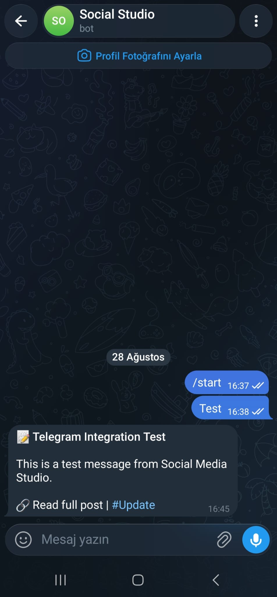
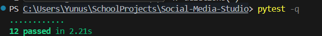
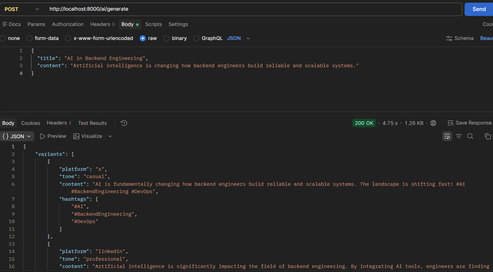
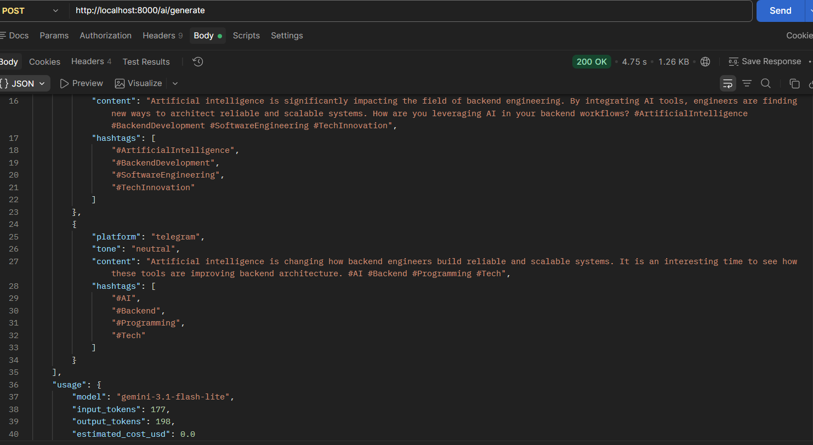

# Acceptance Evidence

This file records reproducible acceptance evidence for the Social Media Studio capstone. The six probes below follow the capstone acceptance flow; the Gemini evaluation is documented separately as additional evidence.

## Probe 1 — Ingestion and variant generation

The acceptance suite verifies that a post can be ingested successfully and that platform variants are created from the supplied source content. The acceptance helper uses `POST /posts/ingest`, then `GET /posts/{post_id}/variants`, and verifies the created variant data before approval. fileciteturn45file0L2-L2

Representative acceptance coverage:

```text
POST /posts/ingest -> 201
GET /posts/{post_id}/variants -> 200
variants created from supplied source content
```

## Probe 2 — Constraint validation

Platform-specific constraints are enforced deterministically. Invalid variants are rejected rather than published, while valid variants can continue through the review workflow. Constraint and tone validation are covered by the test suite.

```text
invalid variant -> constraint validation failure
valid variant -> validation accepted
```

## Probe 3 — Unapproved publish is rejected

A newly ingested variant remains in `draft` status. Attempting to publish it before approval is explicitly tested and must return HTTP 403. fileciteturn45file0L2-L2

```text
POST /publish/schedule with draft variant
-> HTTP 403
-> publish blocked by review gate
```

## Probe 4 — Approved scheduled publish and real Telegram delivery

An approved variant can be scheduled for a future time and persisted as a scheduled job. The acceptance suite verifies that a future job returns `scheduled` and is visible through `/publish/jobs`. fileciteturn45file0L2-L2

The real Telegram adapter was additionally verified end-to-end with an approved Telegram variant. A fresh idempotency key was used and the resulting message was received in the configured Telegram bot chat.

```text
variant_id: 12
platform: telegram
idempotency_key: telegram-final-test-001
result: published
Telegram chat: message received
```



## Probe 5 — Retry / restart safety and idempotency

The acceptance suite verifies that the same idempotency key can be submitted twice without creating a duplicate delivery. The first request succeeds and the second returns `already_processed`; publish history contains exactly one record for that key. fileciteturn45file0L2-L2

It also verifies due-job processing by enqueueing a scheduled job, moving it to the due state, running the worker, and checking that the job becomes `completed`. fileciteturn45file0L2-L2

```text
first publish -> success
repeat with same idempotency key -> already_processed
publish history for key -> 1 record
scheduled job made due -> worker processed -> completed
```

## Probe 6 — Adapter swap

The `SocialPublisher` abstraction keeps publishing logic independent from platform-specific adapters. The acceptance test verifies the configured mapping: X and LinkedIn use mocks while Telegram uses the real adapter. fileciteturn45file0L2-L2

```text
x         -> MockXPublisher
linkedin  -> MockLinkedInPublisher
telegram  -> TelegramPublisher
```

The real Telegram screenshot above demonstrates that the same publishing workflow can reach a real external platform, while X and LinkedIn remain intentionally mocked for the capstone.

## Additional Evidence — Gemini AI generation

The optional AI endpoint was manually verified through `/ai/generate` using the configured Gemini environment variables.

Verified model:

```text
GEMINI_MODEL=gemini-3.1-flash-lite
```

Successful response evidence:

```text
HTTP 202
variants: 3
platforms: x, linkedin, telegram
input_tokens: 177
output_tokens: 207
model: gemini-3.1-flash-lite
estimated_cost_usd: 0
```

### Swagger screenshots







## Additional Evidence — V2 AI evaluation

Five representative cases were generated using the real Gemini integration and evaluated with `evaluation/evaluate_ai.py`.

```text
Cases: 5
Passed: 5/5
Pass rate: 100.0%
PASS backend-ai
PASS product-launch
PASS technical-update
PASS engineering-practice
PASS remote-collaboration
```

Every case passed all five evaluator checks: exactly three variants, all supported platforms, valid structured fields, platform constraints, and source-content presence.

| Metric | Result |
|---|---:|
| Evaluation cases | **5** |
| Cases passed | **5/5** |
| Overall pass rate | **100%** |
| Exactly three variants | 5/5 |
| All supported platforms present | 5/5 |
| Structured fields valid | 5/5 |
| Platform constraints valid | 5/5 |
| Source content present | 5/5 |

The evaluator measures deterministic structural and platform constraints. It does not claim to automatically measure semantic quality or hallucination risk.

## Reproducibility

Evaluation inputs are committed in `evaluation/eval_cases.json`; the evaluator is `evaluation/evaluate_ai.py`. Generated `evaluation/eval_results.json` is local evaluation output and is intentionally not required in the repository.

The acceptance test suite is in `tests/test_acceptance.py` and covers the review gate, idempotency, durable scheduling, worker processing, and adapter contract. fileciteturn44file0L2-L2

## Submission checklist

- [x] README with architecture, run steps, demo flow, AI configuration, evaluation results, transparency disclosure, and limitations
- [x] `.env.example`
- [x] `capstone.yaml` grader manifest
- [x] SQLite persistence
- [x] durable scheduled jobs
- [x] idempotency key persistence
- [x] review gate
- [x] platform constraints
- [x] mock X/LinkedIn adapters
- [x] real Telegram adapter
- [x] Gemini AI generation
- [x] Gemini-focused unit tests
- [x] five-case AI evaluation
- [x] reproducible acceptance evidence
- [x] Final Swagger/API screenshots committed
- [x] Real Telegram delivery verified

## Limitations

- The scheduler is an in-process worker backed by durable SQLite state; multi-instance production deployment would need a shared database plus distributed job claiming.
- Telegram requires valid bot credentials and a reachable chat for real delivery.
- X and LinkedIn are intentionally mock adapters for the capstone's adapter abstraction demonstration.
- AI-generated variants are not automatically published; human approval remains an explicit step.
- Automated AI evaluation checks deterministic constraints; semantic quality and hallucination detection still require human review.
